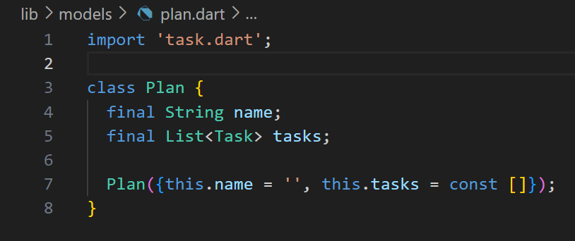
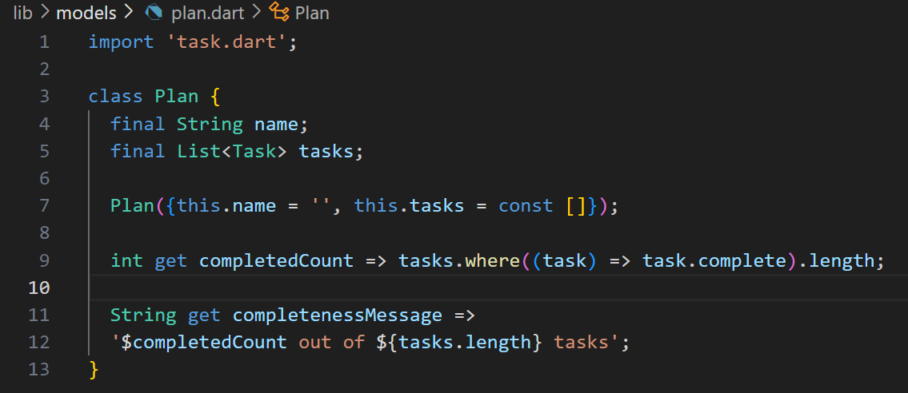

# Laporan Praktikum Dasar State Management

> Nama    : Syahla' Syafiqah Fayra
>
> NIM     : 2141720015
>
> Kelas   : TI - 3G
>
> Link Github : https://github.com/syahla31/

## Praktikum 1: Dasar State dengan Model-View

### Langkah 1: Buat Project Baru


### Langkah 2: Membuat model task.dart


### Langkah 3: Buat file plan.dart


### Langkah 4: Buat file data_layer.dart


### Langkah 5: Pindah ke file main.dart


### Langkah 6: buat plan_screen.dart


### Langkah 7: buat method _buildAddTaskButton()


### Langkah 8: buat widget _buildList()


### Langkah 9: buat widget _buildTaskTile


### Langkah 10: Tambah Scroll Controller


### Langkah 11: Tambah Scroll Listener


### Langkah 12: Tambah controller dan keyboard behavior


### Langkah 13: Terakhir, tambah method dispose()


### Langkah 14: Hasil


## Tugas Praktikum 1: Dasar State dengan Model-View

1. Selesaikan langkah-langkah praktikum tersebut, lalu dokumentasikan berupa GIF hasil akhir praktikum beserta penjelasannya di file README.md! Jika Anda menemukan ada yang error atau tidak berjalan dengan baik, silakan diperbaiki.
2. Jelaskan maksud dari langkah 4 pada praktikum tersebut! Mengapa dilakukan demikian?
    > Langkah 4 dilakukan untuk mempermudah proses import model-model yang telah kita buat. Jadi kita cukup mengimport satu file yaitu 'data_layer.dart' jika kita perlu membutuhkan model yang ada tanpa harus melakukan import model satu persatu. Ini membuat kode menjadi lebih ringkas dan mudah dipelihara karena memungkinkan kita untuk fokus tanpa memikirkan detail model yang ada.

3. Mengapa perlu variabel plan di langkah 6 pada praktikum tersebut? Mengapa dibuat konstanta ?
    > Langkah 6 variabel plan digunakan untuk menyimpan data terkait rencana yang akan ditampilkan. Variable ini akan menyimpan seluruh task yang kita tambahkan dalam bentuk list, dengan adanya variabel ini kita dapat menyimpan, mengubah dan menampilkan task dengan lebih jelas dan efisien. Tanpa variabel ini, kita akan lebih sulit untuk mengupdate atau melihat perubahan yang telah kita lakukan seperti menambahkan dan menghapus task serta mengubah task yang sudah ada.

4. Lakukan capture hasil dari Langkah 9 berupa GIF, kemudian jelaskan apa yang telah Anda buat!
    > 
    >
    > Langkah 9 ini membuat tampilan dinamis untuk setiap tugas dalam plan.tasks. Ini memperlihatkan kotak centang untuk status tugas (selesai/belum selesai) dan kotak teks untuk mengedit deskripsi tugas. Ketika ada perubahan pada salah satu dari itu, setState dipanggil untuk memperbarui plan dengan perubahan yang dilakukan pada tugas tertentu. Ini memungkinkan pengguna untuk mengubah dan menyimpan perubahan langsung dari antarmuka pengguna.

5. Apa kegunaan method pada Langkah 11 dan 13 dalam lifecyle state ?
    > initState() digunakan untuk inisialisasi, disini digunakan untuk mengatur perilaku scrollController saat widget pertama kali dibuat.
    >
    > dispose() dipanggil saat widget tidak diperlukan lagi, digunakan untuk membersihkan sumber daya yang tidak diperlukan, seperti dalam kasus ini, membersihkan scrollController.
    >
    > Kedua method ini, baik initState() maupun dispose(), adalah bagian dari siklus hidup widget dalam Flutter yang membantu dalam persiapan dan membersihkan sumber daya yang diperlukan seiring dengan perubahan status dan penggunaan widget. Ini memastikan pengelolaan memori dan sumber daya yang efisien selama aplikasi berjalan.
6. Kumpulkan laporan praktikum Anda berupa link commit atau repository GitHub ke spreadsheet yang telah disediakan!

## Praktikum 2: Mengelola Data Layer dengan InheritedWidget dan InheritedNotifier

### Langkah 1: Buat file plan_provider.dart


### Langkah 2: Edit main.dart


### Langkah 3: Tambah method pada model plan.dart


### Langkah 4: Pindah ke PlanScreen


### Langkah 5: Edit method _buildAddTaskButton


### Langkah 6: Edit method _buildTaskTile


### Langkah 7: Edit _buildList


### Langkah 8: Tetap di class PlanScreen


### Langkah 9: Tambah widget SafeArea


## Tugas Praktikum 2: InheritedWidget
1. Selesaikan langkah-langkah praktikum tersebut, lalu dokumentasikan berupa GIF hasil akhir praktikum beserta penjelasannya di file README.md! Jika Anda menemukan ada yang error atau tidak berjalan dengan baik, silakan diperbaiki sesuai dengan tujuan aplikasi tersebut dibuat.
2. Jelaskan mana yang dimaksud InheritedWidget pada langkah 1 tersebut! Mengapa yang digunakan InheritedNotifier?
    > Pada langkah 1, "InheritedWidget" digunakan sebagai superclass dari "PlanProvider". InheritedWidget adalah bagian dari Flutter yang memungkinkan data untuk diwariskan ke widget di dalam pohon widget tanpa perlu melewati data secara langsung melalui konstruktor widget. Ini berguna dalam situasi di mana beberapa widget di dalam subtree perlu mengakses data yang sama. 
    > 
    > "InheritedNotifier" adalah variasi dari "InheritedWidget" yang berisi Notifier (dalam hal ini, "ValueNotifier"). Notifier ini digunakan untuk memberitahukan widget-widget yang menggunakan "PlanProvider" tentang perubahan pada objek "Plan".
3. Jelaskan maksud dari method di langkah 3 pada praktikum tersebut! Mengapa dilakukan demikian?
    > Method-method yang digunakan pada langkah 3 berfungsi untuk menghitung jumlah task yang selesai dan return hasilnya. Kemudian completenessMessage berfungsi untuk menunjukkan pesan mengenai jumlah task yang telah selesai.
4. Lakukan capture hasil dari Langkah 9 berupa GIF, kemudian jelaskan apa yang telah Anda buat!

    

    > Praktikum 2 ini menambahkan sebuah text dibawah yang menunjukkan jumlah task yang telah diselesaikan atau diceklis dari aplikasi Praktikum 1. Kemudian terdapat tambahan pada kode program untuk menerapkan state management yang baik dengan menggunakan InheritedWidget dan InheritedNotifier.

5. Kumpulkan laporan praktikum Anda berupa link commit atau repository GitHub ke spreadsheet yang telah disediakan!

## Praktikum 3: Membuat State di Multiple Screens

### Langkah 1: Edit PlanProvider


### Langkah 2: Edit main.dart


### Langkah 3: Edit plan_screen.dart


### Langkah 4: Error

### Langkah 5: Tambah getter Plan


### Langkah 6: Method initState()


### Langkah 7: Widget build


### Langkah 8: Edit _buildTaskTile


### Langkah 9: Buat screen baru


### Langkah 10: Pindah ke class _PlanCreatorScreenState
```
import 'package:flutter/material.dart';
import '../provider/plan_provider.dart';
import '../models/data_layer.dart';
import '../views/plan_screen.dart';

class PlanCreatorScreen extends StatefulWidget {
  const PlanCreatorScreen({super.key});

  @override
  State<PlanCreatorScreen> createState() => _PlanCreatorScreenState();
}

class _PlanCreatorScreenState extends State<PlanCreatorScreen> {
  final textController = TextEditingController();
  @override
  Widget build(BuildContext context) {
    return Scaffold(
      // ganti ‘Namaku' dengan nama panggilan Anda
      appBar: AppBar(title: const Text('Master Plans Syahla')),
      body: Column(children: [
        _buildListCreator(),
        Expanded(child: _buildMasterPlans())
      ]),
    );
  }

  @override
  void dispose() {
    textController.dispose();
    super.dispose();
  }

  Widget _buildListCreator() {
    return Padding(
        padding: const EdgeInsets.all(20.0),
        child: Material(
          color: Theme.of(context).cardColor,
          elevation: 10,
          child: TextField(
              controller: textController,
              decoration: const InputDecoration(
                  labelText: 'Add a plan', contentPadding: EdgeInsets.all(20)),
              onEditingComplete: addPlan),
        ));
  }

  void addPlan() {
    final text = textController.text;
    if (text.isEmpty) {
      return;
    }
    final plan = Plan(name: text, tasks: []);
    ValueNotifier<List<Plan>> planNotifier = PlanProvider.of(context);
    planNotifier.value = List<Plan>.from(planNotifier.value)..add(plan);
    textController.clear();
    FocusScope.of(context).requestFocus(FocusNode());
    setState(() {});
  }

  Widget _buildMasterPlans() {
    ValueNotifier<List<Plan>> planNotifier = PlanProvider.of(context);
    List<Plan> plans = planNotifier.value;

    if (plans.isEmpty) {
      return Column(
          mainAxisAlignment: MainAxisAlignment.center,
          children: <Widget>[
            const Icon(Icons.note, size: 100, color: Colors.grey),
            Text('Anda belum memiliki rencana apapun.',
                style: Theme.of(context).textTheme.headlineSmall)
          ]);
    }
    return ListView.builder(
        itemCount: plans.length,
        itemBuilder: (context, index) {
          final plan = plans[index];
          return ListTile(
              title: Text(plan.name),
              subtitle: Text(plan.completenessMessage),
              onTap: () {
                Navigator.of(context).push(MaterialPageRoute(
                    builder: (_) => PlanScreen(
                          plan: plan,
                        )));
              });
        });
  }
}
```

### Langkah 11: Pindah ke method build


### Langkah 12: Buat widget _buildListCreator


### Langkah 13: Buat void addPlan()


### Langkah 14: Buat widget _buildMasterPlans()


## Tugas Praktikum 3: State di Multiple Screens

1. Selesaikan langkah-langkah praktikum tersebut, lalu dokumentasikan berupa GIF hasil akhir praktikum beserta penjelasannya di file README.md! Jika Anda menemukan ada yang error atau tidak berjalan dengan baik, silakan diperbaiki sesuai dengan tujuan aplikasi tersebut dibuat.
2. Berdasarkan Praktikum 3 yang telah Anda lakukan, jelaskan maksud dari gambar diagram berikut ini!
    > Di sebelah kanan, tampilan PlanScreen menampilkan daftar rencana yang ada setelah navigasi. Data juga diatur oleh PlanProvider, dan layoutnya menggunakan Column, Expanded, dan SafeArea. Terdapat ListView untuk menampilkan daftar rencana dan elemen Text di bawah SafeArea untuk pesan tentang kelengkapan rencana.
    > Diagram sebelah kiri adalah tahap pembuatan rencana baru dalam aplikasi, di mana pengguna berinteraksi dengan PlanCreatorScreen. Data rencana dan daftar rencana dikelola oleh PlanProvider di bawah MaterialApp, dengan layout menggunakan Column dan Expanded.
    > Transisi antara keduanya terjadi saat pengguna beralih antara pembuatan rencana (PlanCreatorScreen) dan melihat rencana yang sudah ada (PlanScreen).
3. Lakukan capture hasil dari Langkah 14 berupa GIF, kemudian jelaskan apa yang telah Anda buat!
    
    

    > Diagram sebelah kiri adalah tahap pembuatan rencana baru dalam aplikasi, di mana pengguna berinteraksi dengan PlanCreatorScreen. Data rencana dan daftar rencana dikelola oleh PlanProvider di bawah MaterialApp, dengan layout menggunakan Column dan Expanded.

4. Kumpulkan laporan praktikum Anda berupa link commit atau repository GitHub ke spreadsheet yang telah disediakan!

